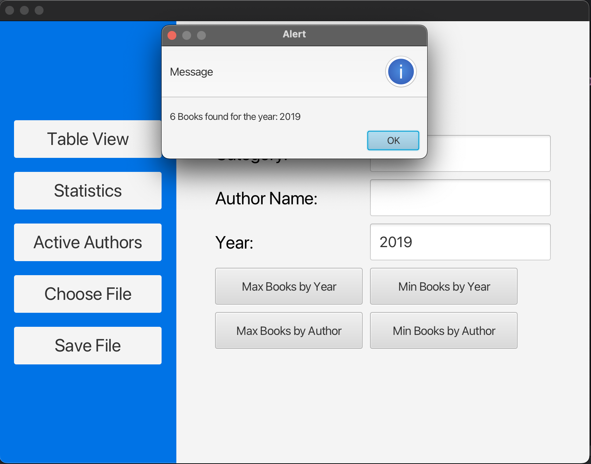

# JAVAFX-Library-Management-System

This is a simple Library Management System built with JavaFX and ArrayList for managing book records.

## Features

- Load books from a text file (`books.txt`)
- Display books in a TableView
- Add new book records
- Delete books by BookID
- Search for books by BookID or Title
- Show statistics:
  - Number of books by category
  - Number of books by author
  - Number of books published in a specific year
  - Year with maximum/minimum books published
  - Author with maximum/minimum books published
  - Check if an author is still active (published in last 5 years)
- Save updated data to `updatedBooks.txt`
- Sort books by Title, Author, or Published Year
- Edit book records

## Screenshots of the App

